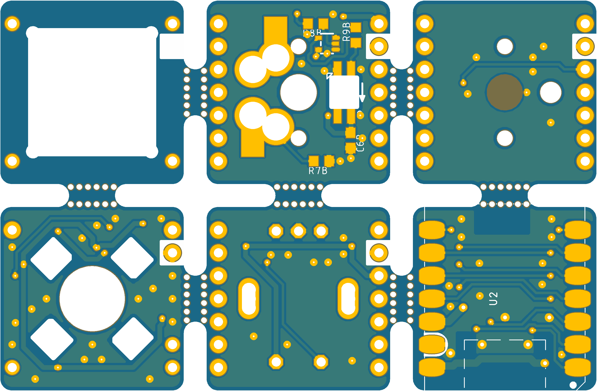

# SR01-Keyboard-PCB

## Intent

A 1-key<small>1</small> *"keyboard"* development set, with QMK, ZMK and custom f/w.

## Features

This is not a "keyboard" per-se, it's a PCB that allows you you, with a **SeeedStudio** <a href="https://www.seeedstudio.com/XIAO-RP2040-v1-0-p-5026.html">XIAO RP2040</a> or <a href="https://www.seeedstudio.com/Seeed-XIAO-BLE-nRF52840-p-5201.html">XIAO nRF52840</a> module, to build:

* a 1-key MX-switch keyboard, with an RGB LED,  - *or* -
* a 1-key HE *(Hall Effect)* switch keyboard, with a white LED,  - *or* -
* a EC11 Rotary Encoder, with 4 RGB LED's,  - *or* -
* a WHID solution, when paired with a **SeeedStudio**:
  * <a href="https://www.seeedstudio.com/Seeed-XIAO-ESP32C3-p-5431.html">XIAO ESP32C3</a> module, *or*
  * <a href="https://www.seeedstudio.com/XIAO-ESP32S3-p-5627.html">XIAO ESP32S3</a> module, *or*
  * <a href="https://www.seeedstudio.com/Seeed-Studio-XIAO-ESP32C6-p-5884.html">XIAO ESP32C6</a> module.

## Why?

When I built the SR61, one of the MicroMod modules I wanted to build for was the [SparkFun MicroMod ESP32 Processor](https://www.sparkfun.com/products/16781).. and for that I bought a [April Brother WHID Cactus](https://store.aprbrother.com/product/wifi-hid-injector) ... and then never got around to it.

The intent was to create a Wireless KB *(like a BT or 2.4GHz KB, but with WiFi)*, and also a whole bunch of additional features like a virtual web-KB, or the ability to configure the keys via it's own web interface.

This project is that idea, but modern.  *(The WHID Cactus is a ATmega 32u4 and ESP-12S combo.  Old and limited.)*

And then the tough was:  Why not also make it a Adafruit NeoKey Trinkey- / DigiSpark ATtiny85 USB key- ... -like 1 key?

## Source

* This repo contains the EAGLE CAD source for the PCB.

* Schematic is [here](docs/sr01-revC.pdf).

## Under Development

I'll add more here after I've prototyped it - and built the firmware.

&nbsp; &nbsp;

---
Made with :heart: by Silvino Rodrigues
